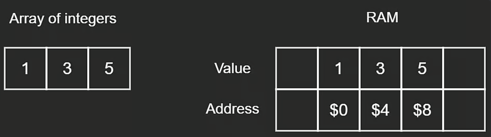

## Array

#### RAM
- **R**andom **A**ccess **M**emory can be thought of as a contiguous block of data
- RAM has two components: Value and Address
- RAM is measured in bytes
  - GB = $10^{9}$ bytes
  - Byte = 8 Bits
  - Bit = 0 or 1
- Integers take 4 bytes (32 bits) to store in memory
- Characters take 1 byte (8 bits) to store in memory

#### 1. Static Array
- Static arrays are fixed size
- Read/Write i-th element is O(1)
  - Index of array is mapped to a location in memory making reading or writing data possible in constant time
- Insert/Remove end element is O(1)
  - Arrays are contiguous and its elements can be accessed with indexing which makes inserting or removing the end element possible in constant time
- Insert/Remove middle element is O(n)
  - The worst case is O(n) because we might need to shift every value in the array

#### 2. Dynamic Array

- Default in Python and JavaScript
- Operations: Push, Pop
- Pointer for last element of dynamic array (used for operations)
- Expanding the dynamic array has a time complexity of O(n)
  - Create a new array that is double the original size of the array and push all the original values into the new array
  - We double the size of the original array as a middle ground to not having to allocate every single time the dynamic array needs to expand and allocating too much empty space which takes up a large amount of memory
  - Expanding the dynamic array by doubling the orginal array when running out of space actually has a time complexity of O(n) but this happens infrequently, so we can say that the amortized time complexity is O(1), which can be thought of as the average time taken per operation
    - **Amortized Time Comlpexity**, which is the way to express the time complexity when an algorithm has the very bad time complexity only once in a while besides the time complexity that happens most of time
    - Why double the capacity? **Power Series**
  - Read/Write i-th element is O(1)
  - Insert/Remove end element is O(1)
  - Insert/Remove middle element is O(n)

#### 3. Stack
- Operations: Push, Pop, Peek/Top
- All stack operations have a time complexity of O(1) or constant time
- Basically a dynamic array that is often times visualized as a vertical dynamic array
- FILO (first in, last out) or LIFO (last in, first out)
  - This means the order in which the elements are removed is the reverse of the order in which the elements were inserted in
  - Can use stacks to reverse a sequence